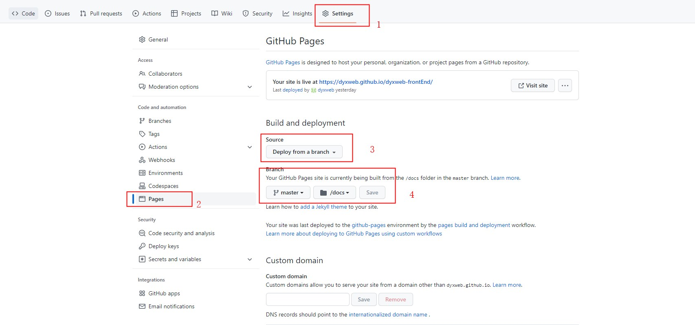

## 手把手教你使用Github部署前端SPA应用
### Github Pages
> 为我们的项目提供一个访问站点，并且直接指向我们的仓库，仓库更新站点网站自动更新。无需服务器资源免费使用。

### Github项目配置Pages
> github项目Settings => Pages下配置部署形式，选择使用分支的形式部署。部署目录选择docs，方便我们调整SPA应用的打包目录。


### 修改我们SPA项目的打包目录为docs
> 由于我们Github Pages的部署目录选择了docs目录，所以我们将SPA项目的打包目录调整为docs。

```
// webpack.prod.js
module.exports = merge(common, {
  mode: 'production',
  entry: {
    main: "./src/index.js"
  },
  output: {
    publicPath: '/',
    path: path.resolve(__dirname, '../docs'),
    filename: '[name].[contenthash].js',
  },
}
```
### 修改我们SPA项目的打包publicPath值为项目部署的地址
> 当我们配置publicPath值为'/'时，我们的index.html会使用绝对路径引用js、css资源。由于Github部署的最终地址为`https://dyxweb.github.io/dyxweb-frontEnd`，使用绝对路径引用js、css资源会导致我们的js、css资源找不到。修改我们SPA项目的打包publicPath值为项目部署的地址后我们的index.html会根据此地址引用js、css资源，可以正常引用js、css资源。

```
// webpack.prod.js
module.exports = merge(common, {
  mode: 'production',
  entry: {
    main: "./src/index.js"
  },
  output: {
    publicPath: 'https://dyxweb.github.io/dyxweb-frontEnd/',
    path: path.resolve(__dirname, '../docs'),
    filename: '[name].[contenthash].js',
  },
}

// index.html
// before
<script src="/main.186d8f15fdbebb107601.js"></script>

// after
<script src="https://dyxweb.github.io/dyxweb-frontEnd/main.186d8f15fdbebb107601.js"></script>
```
### 添加路由的前缀，保证路由正常跳转。
> 因为我们使用history的路由形式，由于Github部署的最终地址为`https://dyxweb.github.io/dyxweb-frontEnd`。在Router中添加`basename = "/dyxweb-frontEnd"`保证我们的路由跳转正常。

```
<Router basename="/dyxweb-frontEnd">
  ...
</Router>
```
### 项目可以正常刷新使用
> 因为使用history形式的路由想要可刷新需要服务端支持。docs目录下添加404.html页面，内容同index.html页面。使用此形式实现Github Pages部署的SPA项目可刷新。
