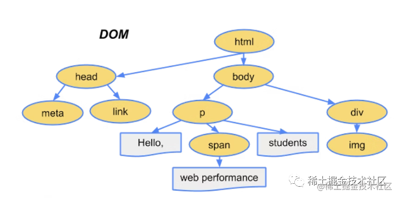
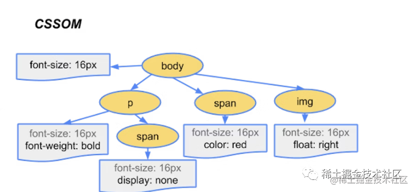
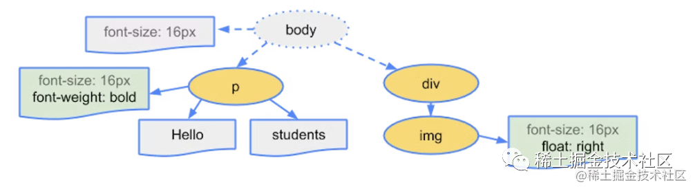

## html渲染
- 构造文档对象模型(DOM)
- 构造CSS对象模型(CSSOM)
- 生成渲染树
- 布局
- 绘制

### 构造文档对象模型(DOM)
> 当浏览器访问网页接受到HTML文档时，会对于接受到的HTML进行Parsing过程（解析HTML文档），这一过程主要分为以下四个阶段。

- 转化
> 首先浏览器从磁盘（缓存）或网络读取HTML的原始字节，并根据文件的指定编码（例如UTF-8）将它们转换为单个字符。

- 词法分析
> 浏览器会将上一步骤得到的字符串转换为一个一个Token（如W3C HTML5标准所指定的例如`<html>`、`<body>`以及尖括号内的其他字符串）。每个Token都有特殊的含义和自己的一套规则。

- 语法分析
> 浏览器会将上一步的到的Tokens转换为一个“对象”，这些对象定义了它们的属性和规则。

- 构造DomTree
> 构造文档对象模型的最后一步就是构建DomTree。因为HTML中定义了不同标签之间的关系（一些标签包含在其他标签中等等），所以最终浏览器的到的对象是一个树型结构，该结构中通过嵌套等关系描述了文档中不同标签的关系。

### 构造CSS对象模型(CSSOM)
- CSS的处理和HTML差不多，CSS文件经过转化为字符、词法分析、语法分析、构造树状的CSSOM。
- 之所以将CSS也处理为树状结构，是因为CSS的规则是支持“向下级联”的嵌套方案的，也就是我们在日常开发中CSS的继承特性。浏览器在计算节点的样式时，它会从适用于该节点的最通用（顶层）的规则开始进行计算，之后会一层一层进行递归从而得到该节点最终的样式。
- CSS写在style标签中在chrome中style标签会被Html Parse来解析。
- 加载样式脚本并不会阻塞后续DOM解析（这里的非阻塞更多相对于JS文件，因为同步JS文件的加载是会阻塞后续DOM解析的），而主线程构造CSS对象模型的过程是会和构造文档对象模型抢占主线程资源的（主线程并不会同时构造CSS对象模型以及同时构造文档对象模型）。

### 生成渲染树
- 上述的两个过程中基于HTML和CSS分别得到了DomTree以及CssomTree，此时这两棵树是互相独立的两个树状对象。
- DomTree描述了页面中所有的DOM结构内容，CssomTree描述了需要应用在页面节点上的样式规则。
- 浏览器会将两个Tree进行合并，最终组成一个具有所有可见（元素在布局中仍然占据空间）节点样式和内容的RenderTree。
  1. 从DomTree开始遍历，遍历每一个可见节点。一些脚本标签、元标签等节点是不可见的会被省略。对于一些通过CSS隐藏的节点，也会从渲染树中省略。
  2. 对于DomTree中的每个可见节点，在CssomTree中找到合适匹配的CSSOM规则并应用它们。
  3. 最终在RenderTree上挂载这些带有内容以及样式的可见节点。

### 布局
- 上述过程得到RenderTree后，浏览器已经明确的清楚哪些节点应该被渲染到页面上同时也获得了可见节点的样式，但是浏览器并未计算出每个节点在对应设备（屏幕）上确切的位置和大小。
- 布局过程会计算出每个节点在对应设备（屏幕）上确切的位置和大小。
### 绘制
- 一旦渲染树创建并且布局完成，像素就可以被绘制在屏幕上，既然浏览器已经明确的知道哪些节点是可见的，以及它们的样式和几何形状，绘制阶段就是将RenderTree中的每个节点转换为屏幕上的实际像素。
### CSS加载不会阻塞构造文档对象模型，但是CSS加载会阻塞生成渲染树。 
- 构造文档对象模型和构造CSS对象模型是并行的，这也解释了CSS加载不会阻塞构造文档对象模型。
- 由于RenderTree是依赖于DomTree和CssomTree的，所以RenderTree必须等待CssomTree构建完成，也就是CSS资源加载完成(或者CSS资源加载失败)后，才能开始生成渲染树。因此CSS加载会阻塞生成渲染树。
- 由于js可能会操作之前的DOM节点和CSS样式，因此浏览器会维持html中CSS和JS的顺序。因此CSS会在后面的JS执行前先加载执行完毕。所以CSS会阻塞后面JS的执行。

