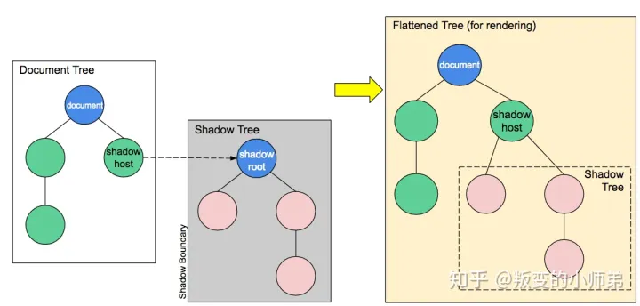

## WebComponent
> Web Component是一种W3C标准支持的组件化方案，通过它可以编写可复用的组件，同时我们也可以对自己的组件做更精细化的控制。

- Custom elements：自定义元素，通过使用对应的 api，可以在不依赖框架的情况下开发原生层面的自定义元素，它将包含独立的生命周期，以及提供了自定义属性的监听。
- ShadowDOM：影子dom(最大的特点是不暴露给全局)，可以通过对应的 api，将 shadow dom 附加给自定义元素，并控制其相关功能。利用 shadow dom 的特性，起到隔离的作用，使特性保密，不用再担心所编写的脚本及样式与文档其他部分冲突。
- HTML 模版：通过`<template/>、<slot/>`去实现内容分发。

### 定义 TextReverse 组件，TextReverse 只有一个很简单的功能，就是把传入的 字符串颠倒显示。
> 使用`<text-reverse text='123'></text-reverse>` 将会显示 321。

#### 定义组件
- 继承 HTMLElement，然后在 构造函数 中编写自己的初始化逻辑。
  1. 初始化过程中首先创建了一个shadowRoot相当于是整个组件的一个根结点。
  2. 我们获取到自身的 text 属性，并且将其倒置放入新创建的 span 元素中。
  3. 我们把带有 text 的 span 塞入 shadowRoot。
```
class TextReverse extends HTMLElement {
  constructor() {
    super();
    const shadowRoot = this.attachShadow({ mode: 'open' });
    const text = this.getAttribute('text') || '';
    const wrapper = document.createElement('span');
    wrapper.textContent = text.split('').reverse().join('');
    shadowRoot.appendChild(wrapper);
  }
}
```
- 定义完成之后，需要组件注册(注册的名字必须是带短横线的)。
```
customElements.define(
  'text-reverse',
  TextReverse
)
```
### Shadow Dom
> 上面的例子中，我们用到了 shadow root，它承载着我们组件所有的内容。这是 Web Component 核心技术。Dom 其实就是一棵树，而我们的组件则是树上的一个节点。我们可以称组件节点为 shadow host。shadow host 中含有一颗与外界隔离的 dom 树，我们称之为 shadow tree。shadow tree 中的内容不会影响到外界。Shadow Root 则是这一课shadow tree 的根节点。


- shadow dom 一大亮点就是样式隔离。这种样式隔离的特性很好地避免了不同组件之间的样式干扰。

### Template
> 在上面的例子中，采用代码的方式来创建修改节点。这种方法比较低效。可以使用 Template 来解决这问题。 html中定义了一个 template，然后，就和操作普通元素一样获取到 template 节点，然后深拷贝一份节点内容,最后直接操作这个节点。

```
<template id='text-reverse'>
  <style>
    *{
      background: red;
    }
  </style>
  <span id='text'></span>
</template>
class TextReverse extends HTMLElement {
  constructor() {
    super();
    const shadowRoot = this.attachShadow({ mode: 'open' });
    const text = this.getAttribute('text') || '';
    const template = document.getElementById('text-reverse').content.cloneNode(true);
    template.getElementById('text').textContent = text.split('').reverse().join('');
    shadowRoot.appendChild(template);
  }
}
```
### Slot
> 和 Vue 的 Slot 相似，Slot 赋予了组件更高的可扩展性。通过 Slot，可以给组件传入更多的自定义内容。模版中定义一个 slot 元素，命名为 title，并且设置一个无内容时的默认值 default title。使用的时候，我们在元素中添加一个 slot 属性来与模版中的 slot 相匹配。

```
<text-reverse text='12345'>
  <span slot='title'>text reverse</span>
</text-reverse>

<template id='text-reverse'>
  <h1><slot name='title'>default title</slot></h1>
  <span id='text'></span>
</template>
```
### 继承现有元素
> 假如我们想扩展现有系统元素，那就需要定义一个 内置自定义元素。 以一个屏蔽数字的 p 元素为例。不再是继承 HTMLElement，而是继承需要扩展的 p节点 HTMLParagraphElement。不同于独立自定义组件，我们还是需要用原有元素名去声明，并且在 is 属性中填写我们的组件名。

```
class PFilter extends HTMLParagraphElement {
  constructor() {
    super();
    const textContent = this.textContent;
    this.textContent = textContent.replace(/\d/g, '*');
  }
}
customElements.define(
  'p-filter',
  PFilter,
  {
    extends: 'p'
  }
)

// 使用
<p is='p-filter'>我的手机号是：10086</p>
```
### 生命周期
> Web Component 也含有许多控制组件生命周期的方法。 只需在定义组件的类中声明对应的方法即可。attributeChangedCallback 相对与别的属性比较特别，他需要 搭配 observedAttributes 使用。

1. connectedCallback：当 custom element首次被插入 DOM 时被调用。 
2. disconnectedCallback：当 custom element 从 DOM 中删除时被调用。 
3. adoptedCallback：当 custom element 被移动到新的文档时被调用。 
4. attributeChangedCallback: 当 custom element 增加、删除、修改自身属性时被调用。
```
// 我们在 observedAttributes静态方法中添加需要监听的属性值。然后，在 text 改变的时候，触发 attributeChangedCallback方法来更新 text的值。
class TextReverse extends HTMLElement {
  //...
  static get observedAttributes () {
    return ['text'];
  }
  attributeChangedCallback () {
    const text = this.getAttribute('text') || '';
    this.shadowRoot.getElementById('text').textContent = text.split('').reverse().join('');
  }
}
```
### 优缺点
- 优点
  1. 浏览器原生支持，不用加入任何依赖。
  2. 多种场景适用，天生组件隔离。
- 缺点
  1. 跟主流的框架相比，书写较为复杂，需要开发者自己进行原生 dom 操作。
  2. 若要写成单文件组件，需要采用模板字符串的写法，没有语法高亮，代码提示等。