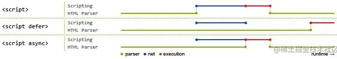
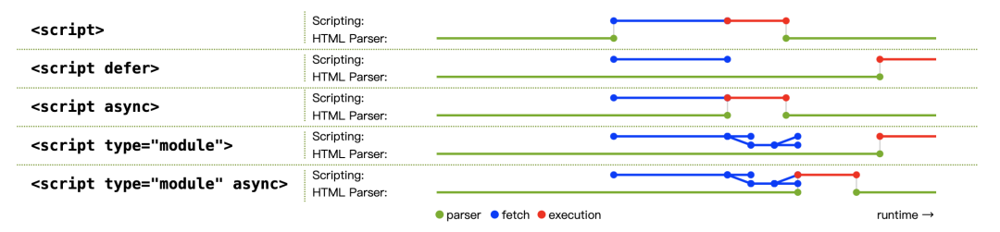

## js加载方式
### 正常模式(同步加载)
- 默认情况下浏览器是同步下载js脚本，浏览器会立即下载并执行相应的脚本，这种情况下js下载会阻塞dom渲染。
- 如果脚本体积很大，下载和执行的时间就会很长，因此造成浏览器堵塞，用户会感觉到浏览器“卡死”了，没有任何响应。
```
<script src="index.js"></script>
```
### async模式(异步加载)
- async模式下js下载是异步的，js下载结束会立即执行，js下载不会阻塞dom渲染。
- async模式下js下载是无顺序的，当js下载结束会立即执行，渲染引擎就会中断渲染，执行完这个脚本以后，再继续渲染。
- 若该js资源与dom元素没有依赖关系，也不会产生其他资源所需要的数据时，可以使用async模式，比如埋点统计。
```
<script async src="index.js"></script>
```
### defer模式(延迟加载)
- defer模式下js下载也是异步的，会在文档完成解析后触发DOMContentLoaded事件前执行js资源，js下载不会阻塞dom渲染。
- defer模式下js下载是有顺序的，如果有多个设置了defer的script标签存在，则会按照引入的前后顺序执行，即便是后面的script资源先返回。
- 一般情况下都可以使用defer，特别是需要控制资源执行顺序时，比如element-ui.js和vue.js，因为element-ui.js依赖于vue，所以必须先引入vue.js再引入element-ui.js。
```
<script defer src="vue.js"></script>
<script defer src="element-ui.js"></script>
```
### module模式
- 在主流的现代浏览器中script标签的属性可以加上type="module"，浏览器会对其内部的import引用发起HTTP请求获取模块内容。
- 这时script的行为会像defer模式一样，异步下载js并且会在文档完成解析后触发DOMContentLoaded事件前执行js资源。
- vite就是利用浏览器支持原生的ES Module，开发时跳过打包的过程提升编译效率。
```
<script type="module">
  import { a } from './a.js';
</script>
```
### async与defer
- async和defer属性仅仅对外部脚本起作用。
- async和defer属性都会异步下载js脚本，js脚本下载都不会阻塞页面的解析，但是js的执行一定是和UI线程是互斥的。
- async是下载完就执行，defer是渲染完再执行。



