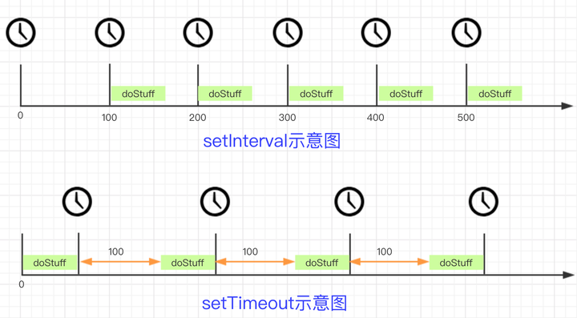

## setTimeout和setInterval
### setTimeout
> 在指定的毫秒数后执行指定代码(只执行一次)。

```
// 使用setTimeout模拟setInterval
function tick() {
  doStuff();
  setTimeout(tick, 100);
} 
tick();
```
### setInterval
> 间隔指定的毫秒数不停地执行指定的代码（一直执行）。

```
function doStuff(){ 
  // 此处为需要执行一段时间T的代码
} 
setInterVal(doStuff, 100);
```
### setInterval和setTimeout实现的setInterval区别

> setInterval每个定时器之间的间隔是100ms，而setTimeout每隔100ms执行一次doStuff，所以每个定时器之间的间隔是100 + T(doStuff执行时间为T)；T的时间不同导致的区别也不同。

- 如果T可以忽略的话，两者的效果是基本相同的。
- T <= 100时， setTimeout定时器间隔100+T，setInterval定时器间隔100。
- T > 100时，setTimeout定时器间隔100+T，setInterval在第一次执行后定时器间隔为执行函数的时间。假设T为140ms。在0ms时，定时器1开始进入宏任务队列；100ms时，定时器1开始执行doStuff1，队列为空，定时器2进入队列；200ms时，因为定时器2(doStuff1还没执行完)在队列中，所以定时器3被跳过。**浏览器不会同时创建两个相同的间隔计时器**。300ms时，定时器2已经开始执行，队列为空，定时器4进入队列。以此类推。

### setInterval效果总结
- setInterval是在特定时间点将代码推入队列，如果已有定时器在队列中，则会跳过。**浏览器不会同时创建两个相同的间隔计时器**。
- setInterval设置定时时间小于函数体内的执行时间时候，在第一次执行后定时器间隔为执行函数的时间。
- setInterval中的异步代码不会阻塞创建新的定时器。定时器中的同步代码会直接进入队列，异步代码注册事件，当异步代码注册事件后，这个定时器就执行完了，并不是等异步代码回来后这个定时器才算结束。

