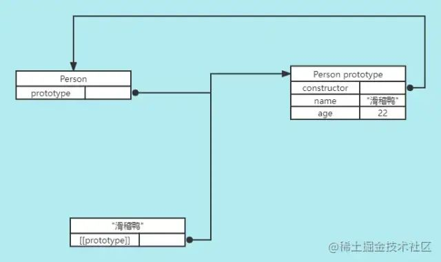
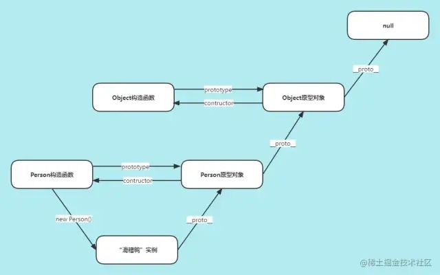

## 原型原型链
### 普通对象与函数对象
> JavaScript中对象分为普通对象和函数对象。通过new Function()创建的对象都是函数对象，其他的都是普通对象。每个对象都有`__proto__`属性，但只有函数对象才有prototype属性。所有函数对象的`__proto__`都指向Function.prototype，它是一个空函数。所有函数对象都继承了Function.prototype的属性及方法，如length、call、apply、bind。

### 原型
> 每个函数都会创建一个prototype属性，这个属性是一个对象，这个对象就是通过调用构造函数创建的对象的原型。使用原型对象的好处是，在它上面定义的属性和方法都可以被实例共享。


### 原型、原型对象、构造函数的关系
> 每个构造函数都有一个原型对象(实例的原型)，原型有一个constructor属性指向构造函数，而实例有一个内部指针(在chrome、firefox、safari浏览器环境中这个指针就是`__proto__`)指向原型。构造函数构造出来的实例的constructor属性指向该构造函数。

- 创建了一个空的构造函数Person。
- 然后创建了一个Person的实例dyx，dyx本身是没有挂载任何属性和方法的，但是它有一个`__proto__`内置属性，这个属性是个对象，里面有name、age属性和getName函数。
- Person.prototype和dyx的`__proto__`都指向同一个对象，这个对象对于Person构造函数而言叫做原型对象，对于dyx实例而言叫做原型。
- 实例dyx的constructor属性指向Person构造函数。
```
// Person构造函数
function Person() {}

// 在Person的原型对象上挂载属性和方法
Person.prototype.name = 'dyx';
Person.prototype.age = 26;
Person.prototype.getName = function() {
  return this.name;
}

const dyx = new Person();
console.log(dyx.name) // 'dyx'
console.log(dyx.getName()); 'dyx'

console.log(Person.prototype.constructor === Person); // true
console.log(dyx.__proto__ === Person.prototype); // true
console.log(dyx.constructor === Person); // true
```
### `__proto__`
> JS 在创建对象（不论是普通对象还是函数对象）的时候，都有一个叫做`__proto__`的内置属性，用于指向创建它的构造函数的原型对象。例如对象dyx有一个 `__proto__`属性，创建它的构造函数是Person，构造函数的原型对象是Person.prototype，所以`dyx.__proto__ === Person.prototype`。

### 原型链
> 如果实例的原型是另一个构造函数的实例，于是该实例的原型本身又有一个内部指针(`__proto__`)指向另一个原型，相应的另一个原型也有一个指针指向另一个原型。这样，实例和原型之间形成了一条长长的链条，这就是原型链。所有普通的原型的`__proto__`都会指向内置的Object.prototype，而Object的原型对象的`__proto__`指向null。也就是说所有的普通对象都源于Object.prototype，它包含javascript中许多通用的功能。


### 对象的属性和方法查找
> 如果在对象上找不到需要的属性或者方法，引擎就会继续在`__proto__`指向的原型上查找，如果在后者也没有找到需要的东西，引擎就会继续查找它的`__proto__`指向的原型。

1. 查找对象自己声明的。
2. 去原型链上查找，在`__proto__`指向的原型上查找，如果在后者也没有找到需要的东西，引擎就会继续查找它的`__proto__`指向的原型。
3. 去Object.prototype上查找(所有的普通对象都源于Object.prototype，它包含javascript中许多通用的功能)。
### 原型对象值修改
- prototype对象重新赋值
> 实例化对象时，该对象的`__proto__`指向当前的构造函数的prototype，如果实例化后构造函数的prototype重新赋值，不会影响已经创建的实例。

```
// Person构造函数
function Person() {}

// 在Person的原型对象上挂载属性和方法
Person.prototype.name = 'dyx';
Person.prototype.age = 26;
Person.prototype.getName = function() {
  return this.name;
}

const dyx = new Person();
console.log(dyx.name); // 'dyx'
Person.prototype = {
  name: 'douyaxing'
}
console.log(dyx.name); // 'dyx'
```
- prototype对象修改属性值或添加属性
> 原型对象的属性值被修改后，或者添加了新的属性，实例化对象的原型值也会发生变化。

```
// Person构造函数
function Person() {}

// 在Person的原型对象上挂载属性和方法
Person.prototype.name = 'dyx';
Person.prototype.age = 26;
Person.prototype.getName = function() {
  return this.name;
}

const dyx = new Person();
console.log(dyx.name); // 'dyx'
console.log(dyx.sex); // undefined
Person.prototype.name = 'douyaxing';
Person.prototype.sex = '男';
console.log(dyx.name); // 'douyaxing'
console.log(dyx.sex); // '男'
```
### 判断构造函数与实例关系
- instanceof
> instanceof操作符左侧是一个普通对象，右侧是一个函数。以dyx instanceof Person为例，instanceof关键字做的事情是判断dyx的原型链上是否有Person.prototype指向的对象。

```
function Person(name) {
  this.name = name;
}

const dyx = new Person('dyx');
const douyaxing = {
  name: 'douyaxing'
}

console.log(dyx instanceof Person) // true
console.log(douyaxing instanceof Person) // false
```
- isPrototypeOf()
> isPrototypeOf()不关心构造函数，它只需要一个可以用来判断的对象就行。以Person.prototype.isPrototypeOf(dyx)为例，isPrototypeOf()做的事情是判断在dyx的原型链中是否出现过Person.prototype。

```
function Person(name) {
  this.name = name;
}

const dyx = new Person('dyx');
const douyaxing = {
  name: 'douyaxing'
}

console.log(Person.prototype.isPrototypeOf(dyx)) // true
console.log(Person.prototype.isPrototypeOf(douyaxing)) // false
```
### Object.getPrototypeOf
> 获取实例对象的原型。

```
// Person构造函数
function Person() {}

// 在Person的原型对象上挂载属性和方法
Person.prototype.name = 'dyx';
Person.prototype.age = 26;
Person.prototype.getName = function() {
  return this.name;
}
 
const dyx = new Person();
Object.getPrototypeOf(dyx) === Person.prototype  // true
```

### hasOwnProperty
> for in循环将循环遍历对象本身以及它所委托的原型的所有可枚举属性，添加到原型的任何属性都是可枚举的(使用 in 操作符检查对象中是否含有某个属性时同理)。hasOwnProperty返回一个布尔值，表示对象是否具有指定的属性作为其自身的属性，而不是对象所委托的原型上的属性。

```
function Animal(name, energy) {
  this.name = name;
  this.energy = energy;
}
Animal.prototype.eat = function(amount) {
  console.log(`${this.name} is eating.`);
  this.energy += amount;
}
 
const leo = new Animal('Leo', 7);
for(let key in leo) {
  console.log(key); // name、energy、eat
}

for(let key in leo) {
  if (leo.hasOwnProperty(key)) {
    console.log(key); // name、energy
  }
}
```
