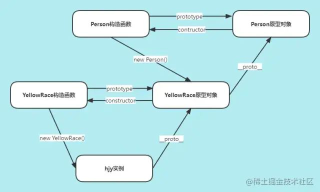
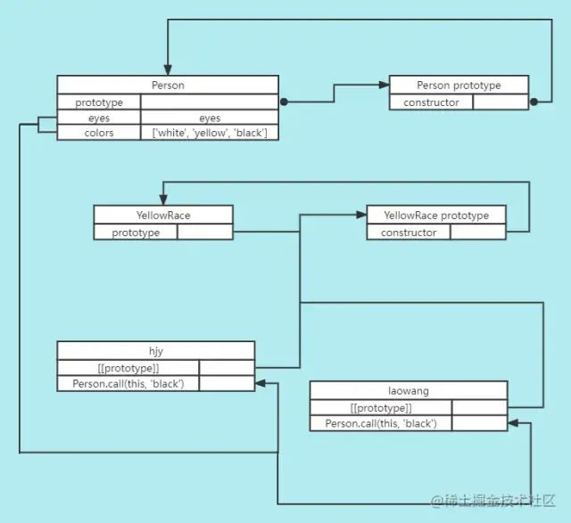
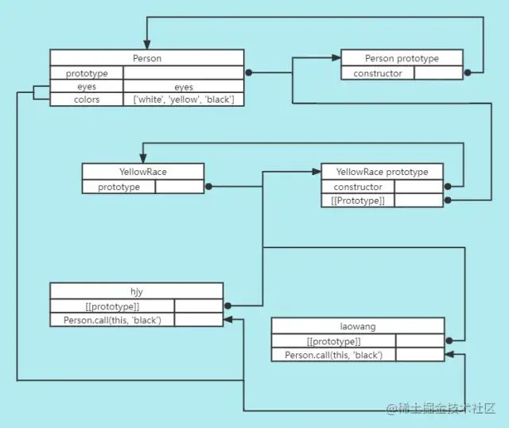
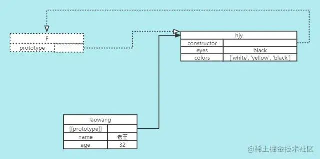

## 继承
> 继承是面向对象编程的三大特征之一（封装、继承、多态）。多个类中存在相同的属性和行为时，将这些内容抽取到单独一个类中，那么多个类无需再定义这些属性和行为，只需要继承那个类即可。多个类可以称为子类，单独这个类称为父类或者超类，基类等。子类可以直接访问父类中的非私有的属性和行为。

### js的继承
> 在其他面向类语言中，继承意味着复制操作，子类是实实在在地将父类的属性和方法复制了过来，但javascript中的继承不是这样的。根据原型的特性，js中继承的本质是一种委托机制，对象可以将需要的属性和方法委托给原型，需要用的时候就去原型上拿，这样多个对象就可以共享一个原型上的属性和方法，这个过程中是没有复制操作的。

### 原型链继承
> 直接利用原型链特征实现的继承，让构造函数的prototype指向另一个构造函数的实例。当查找dyx实例的head和hand属性时，由于dyx本身并没有这两个属性，引擎就会去查找dyx的原型，还是没有，继续查找dyx原型的原型，也就是Person原型对象，结果就找到了。因此YellowPerson和Person之间通过原型链实现了继承关系。

```
function Person() {
  this.head = 1;
  this.hand = 2;
}

function YellowPerson() {};
YellowPerson.prototype = new Person();

const dyx = new YellowPerson();
console.log(dyx.head); // 1
console.log(dyx.hand); // 2
```

#### 原型链继承的问题
1. 创建dyx实例时不能传参，也就是YellowPerson构造函数本身不接受参数。
2. 当原型上的属性是引用数据类型时，所有实例都会共享这个属性，即某个实例对这个属性重写会影响其他实例。
```
function Person() {
  this.colors = ['white', 'yellow', 'black'];
}

function YellowPerson() {};
YellowPerson.prototype = new Person();

const dyx = new YellowPerson();
dyx.colors.push('green');
console.log(dyx.colors); // ['white', 'yellow', 'black', 'green']

const douyaxing = new YellowPerson();
console.log(douyaxing.colors); // ['white', 'yellow', 'black', 'green']
```
### 盗用构造函数继承
> 盗用构造函数也叫作“对象伪装”或者“经典继承”，原理就是通过在子类中调用父类构造函数实现上下文的绑定。YellowPerson在内部使用call调用构造函数，这样在创建YellowPerson的实例时，Person就会在YellowPerson实例的上下文中执行，于是每个YellowPerson实例都会拥有自己的colors属性，而且这个过程是可以传递参数的，Person.call()接受的参数最终会赋给YellowPerson的实例。

```
function Person(eyes) {
  this.eyes = eyes;
  this.colors = ['white', 'yellow', 'black'];
}

function YellowPerson() {
  Person.call(this, 'black'); // 调用构造函数并传参
}

const dyx = new YellowPerson();
dyx.colors.push('green');
console.log(dyx.colors); // ['white', 'yellow', 'black', 'green']
console.log(dyx.eyes); // black

const douyaxing = new YellowPerson();
console.log(douyaxing.colors); // ['white', 'yellow', 'black']
console.log(douyaxing.eyes); // black
```

#### 盗用构造函数继承的问题
1. 必须在构造函数中定义方法，通过盗用构造函数继承的方法本质上都变成了实例自己的方法，不是公共的方法，因此失去了复用性。
2. 子类不能访问父类原型上定义的方法，因此所有类型只能使用构造函数模式，原因是YellowPerson构造函数、dyx和douyaxing实例都没有和Person的原型对象产生联系。
```
function Person(eyes) {
  this.eyes = eyes;
  this.getEyes = function () {
    return this.eyes;
  }
}
Person.prototype.ReturnEyes = function() {
  return this.eyes;
}

function YellowPerson() {
  Person.call(this, 'black');
}

const dyx = new YellowPerson();
console.log(dyx.getEyes()); // black
// dyx实例能继承Person构造函数内部的方法getEyes()，对于Person原型对象上的方法，dyx实例是访问不到的
console.log(dyx.ReturnEyes()) // TypeError: hjy.ReturnEyes is not a function
```
### 组合继承
> 组合继承的原理就是先通过盗用构造函数实现上下文绑定和传参，然后再使用原型链继承的手段将子构造函数的prototype指向父构造函数的实例。相较于盗用构造函数继承，组合继承额外的将YellowPerson的原型对象（同时也是dyx和douyaxing实例的原型）指向了Person的原型对象，这样就集合了原型链继承和盗用构造函数继承的优点。

```
function Person(eyes) {
  this.eyes = eyes;
  this.colors = ['white', 'yellow', 'black'];
}
Person.prototype.getEyes = function() {
  return this.eyes;
}

function YellowPerson() {
  Person.call(this, 'black'); // 调用构造函数并传参
}
YellowPerson.prototype = new Person(); // 再次调用构造函数

const dyx = new YellowPerson();
dyx.colors.push('green');
const douyaxing = new YellowPerson();

console.log(dyx.colors); // ['white', 'yellow', 'black', 'green']
console.log(dyx.getEyes()); // black
console.log(douyaxing.colors); // ['white', 'yellow', 'black']
```

#### 组合继承的缺点
1. 实现的过程中调用了两次Person构造函数，有一定程度上的性能浪费。
### 原型式继承
> object.create()通过第二个参数新增的属性是直接挂载到新建对象本身，而不是挂载在它的原型上。原型式继承非常适合不需要单独创建构造函数，但仍然需要在对象间共享信息的场合。原型式继承和原型链继承中原型与实例之间的关系基本是一致的，不过构造函数是一个中间函数，在object.create()执行完后它就随着函数作用域一起被回收了。

```
const dyx = {
  eyes: 'black',
  colors: ['white', 'yellow', 'black']
}

const douyaxing = Object.create(dyx, {
  name: {
    value: 'douyaxing',
    writable: false,
    enumerable: true,
    configurable: true
  },
  age: {
    value: '26',
    writable: true,
    enumerable: true,
    configurable: false
  }
});
console.log(douyaxing.eyes) // black
console.log(douyaxing.colors) // ['white', 'yellow', 'black']
console.log(douyaxing.name) // douyaxing
console.log(douyaxing.age) // 26
```

#### 原型式继承的缺点
> 原型式继承和原型链继承的本质基本一致，那么原型式继承也有一样的缺点。

- 不能传参，使用手写的object()不能传参数，但使用Object.create()是可以传参的。
- 原对象中的引用类型的属性会被新对象共享。
### 寄生式继承
> 寄生式继承与原型式继承很接近，它的思想就是在原型式继承的基础上以某种方式增强对象，然后返回这个对象。

```
function inherit(obj) {
  let clone = Object.create(obj);
  clone.sayHi = function () { // 增强对象
    console.log('Hi');
  }
  return clone;
}

const dyx = {
  eyes: 'black',
  colors: ['white', 'yellow', 'black']
}
const douyaxing = inherit(dyx)

console.log(douyaxing.eyes); // black
console.log(douyaxing.colors); // ['white', 'yellow', 'black']
douyaxing.sayHi(); // Hi
```
### 寄生式组合继承
> 寄生式组合继承只调用了一次Person造函数，避免了在Person.prototype上面创建不必要、多余的属性。于此同时，原型链依然保持不变，效率非常之高效。

```
function inherit(Father, Son) {
  const prototype = Object.create(Father.prototype); // 获取父类原型对象副本
  prototype.constructor = Son; // 将获取的副本的constructor指向子类，以此增强副本原型对象
  Son.prototype = prototype; // 将子类的原型对象指向副本原型对象
}

function Person(eyes) {
  this.eyes = eyes;
  this.colors = ['white', 'yellow', 'black'];
}
Person.prototype.getEyes = function() {
  return this.eyes;
}

function YellowPerson() {
  Person.call(this, 'black'); // 调用构造函数并传参
}

inherit(Person, YellowPerson) // 寄生式继承，不用第二次调用构造函数

const dyx = new YellowPerson();
dyx.colors.push('green');
const douyaxing = new YellowPerson();

console.log(dyx.colors); // ['white', 'yellow', 'black']
console.log(dyx.getEyes()); // 'black'
console.log(douyaxing.colors); // ['white', 'yellow', 'black', 'green']
```

### es6 class继承
> 使用关键字extends，并使用super关键字将子类的数据传参给父类,super等于调用父类的constructor，但是this指向子类。

```
class Person {	
  constructor(name, age) {
  	this.name = name;
  	this.age = age;	
    this.nickName = 'douyaxing';	
  }
  getInfo() {
    console.log(this.name, this.age, nickName);
  } 
}  


class Man extends Person {	
  constructor(name, age, sex) {
    super(name, age);
  	this.sex = sex;		
  }
  print() {
    console.log(this.sex);
  } 
} 
const dyx = new Man("dyx", 25, "男")
dyx.getInfo() // dyx 25, douyaxing  父类的nickName属性也会继承
dyx.print() // 男
```
