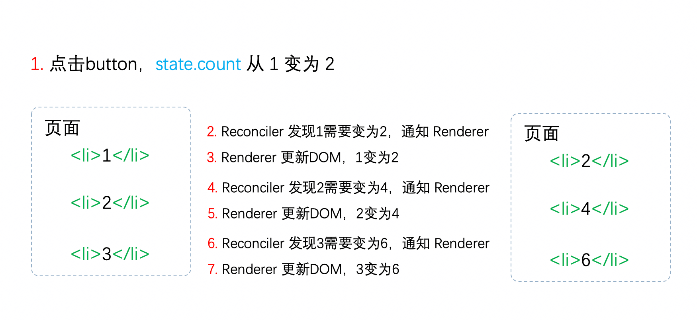
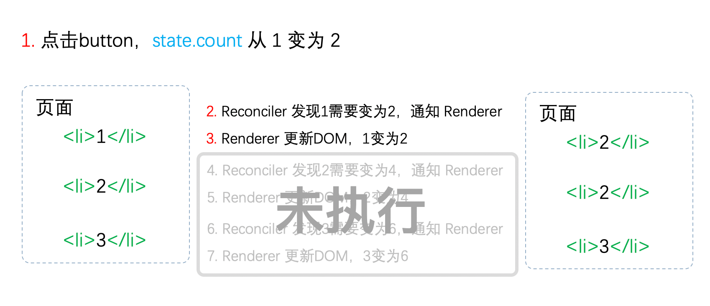

## fiber
- react fiber不会让比较的时间缩短，但它使得diff的过程被分成一小段一小段的，因为它有了“保存工作进度”的能力。js会比较一部分虚拟dom，然后让渡主线程，给浏览器去做其他工作，然后继续比较，依次往复，等到最后比较完成，一次性更新到视图上。
- 新的架构中，每个节点有三个指针：分别指向第一个子节点、下一个兄弟节点、父节点。这种数据结构就是fiber，它的遍历规则为从根节点开始，依次遍历该节点的子节点、兄弟节点，如果两者都遍历了，则回到它的父节点；当遍历发生中断时，只要保留下当前节点的索引，断点是可以恢复的——因为每个节点都保持着对其父节点的索引。
### 组件diff的工作拆分为小段任务的操作且可中断
- 主流浏览器刷新频率为60Hz，即每(1000ms / 60Hz)16.6ms浏览器刷新一次。
- JS可以操作DOM，GUI渲染线程与JS线程是互斥的。所以JS脚本执行和浏览器布局、绘制不能同时执行。在每16.6ms时间内，需要完成如下工作：JS脚本执行 => 样式布局 => 样式绘制。
- 当JS执行时间过长，超出了16.6ms，这次刷新就没有时间执行样式布局和样式绘制了，导致页面掉帧，造成卡顿。
- 在浏览器每一帧的时间中，预留一些时间给JS线程，React利用这部分时间更新组件，当预留的时间不够用时，React将线程控制权交还给浏览器使其有时间渲染UI，React则等待下一帧时间到来继续被中断的工作。
- 这种将长任务分拆到每一帧中，一次执行一小段任务的操作，被称为时间切片。而时间切片的关键是将同步的更新变为可中断的异步更新。
### react16之前
- 在react16引入Fiber架构之前，react会采用递归对比虚拟DOM树(深度优先遍历)，找出需要变动的节点，然后同步更新它们，这个过程react称为reconcilation(协调阶段)。
- 在reconcilation期间，react会一直占用浏览器资源，会导致用户触发的事件得不到响应。
### react16将同步的更新变为可中断的异步更新，如何解决中断更新时DOM渲染不完全的问题
- 在React16中，Reconciler与Renderer不再是交替工作。当Scheduler将任务交给Reconciler后，Reconciler会为变化的虚拟DOM打上代表增/删/更新的标记。
- 整个Scheduler与Reconciler的工作都在内存中进行，不会更新页面上的DOM，所以即使反复中断，用户也不会看见更新不完全的DOM。只有当所有组件都完成Reconciler的工作，才会统一交给Renderer。Renderer根据Reconciler为虚拟DOM打的标记，同步执行对应的真实DOM操作。
### 多个Fiber节点是树的结构，但是以链表数据结构存储
> 依靠三个属性，父节点(return，使用return没有使用parent是因为当子节点和子节点的兄弟节点完成工作后会返回父节点，具体实现可参考简单react实现文件中)、子节点(child)、兄弟节点(sibling)的关联生成一个树状的结构。

### 双缓存
> 在内存中构建并直接替换，React使用“双缓存”来完成Fiber树的构建与替换——对应着虚拟DOM树的创建与更新。

### fiber树
- 在React中最多会同时存在两棵Fiber树。当前屏幕上显示内容对应的Fiber树称为current Fiber树，正在内存中构建的Fiber树称为workInProgress Fiber树。
- current Fiber树中的Fiber节点被称为current fiber，workInProgress Fiber树中的Fiber节点被称为workInProgress fiber，他们通过alternate属性连接，在处理workInProgress Fiber树的时候，能够获得current Fiber树的信息。
### Fiber出来之后，vdom的作用只是作为蓝本进行构建Fiber树。
### element、fiber和DOM元素的关系
- element对象就是我们的jsx代码，上面保存了props、key、children等信息。
- DOM元素就是最终呈现给用户展示的效果。
- fiber就是充当element和DOM元素的桥梁，只要elemnet发生改变，就会通过fiber做一次调和，使对应的DOM元素发生改变。
### 示例
```
import React from "react";

export default class App extends React.Component {
  constructor(...props) {
    super(...props);
    this.state = {
      count: 1
    };
  }
  onClick() {
    this.setState({
      count: this.state.count + 1
    });
  }
  render() {
    return (
      <ul>
        <button onClick={() => this.onClick()}>乘以{this.state.count}</button>
        <li>{1 * this.state.count}</li>
        <li>{2 * this.state.count}</li>
        <li>{3 * this.state.count}</li>
      </ul>
    );
  }
}
```
- 同步更新(react15) 点击button将count从1变为2之后

- 如果中断进行中的更新，将会看到不完全的dom

- 异步可中断更新(react16)
> 其中红框中的步骤随时可能由于以下原因被中断：有其他更高优任务需要先更新，当前帧没有剩余时间。由于红框中的工作都在内存中进行，不会更新页面上的DOM，所以即使反复中断，用户也不会看见更新不完全的。


### 总结
- React Fiber是React 16提出的一种更新机制，使用链表取代了树，将虚拟dom连接，使得组件diff的流程可以被中断恢复。
- 它把组件diff的工作分片，到时会主动让出渲染主线程。
- react fiber这种数据结构(链表)使得节点可以回溯到其父节点，只要保留下中断的节点索引，就可以恢复之前的工作进度。
### Vue没有Fiber的原因
- react中组件更新，会自顶向下重新渲染组件，自顶向下的含义是该组件以及它的子组件全部需要渲染，由于无法做到精确更新，所以需要使用到Fiber将组件渲染工作分割为多个小任务，可以中断和恢复，不阻塞主进程执行高优先级的任务。
- Vue是基于template和watcher的组件级更新，可以做到精准更新，把每个更新任务分割得足够小，不需要使用到Fiber架构将任务进行更细粒度的拆分。
