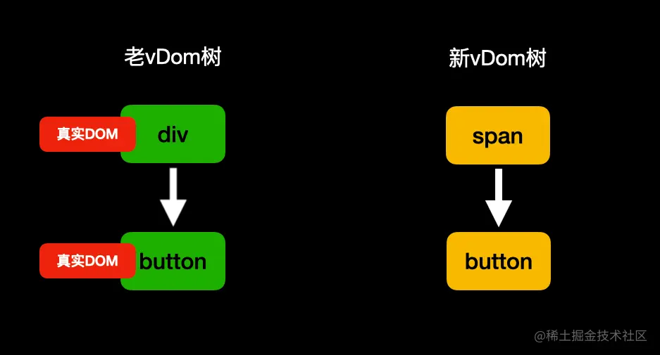
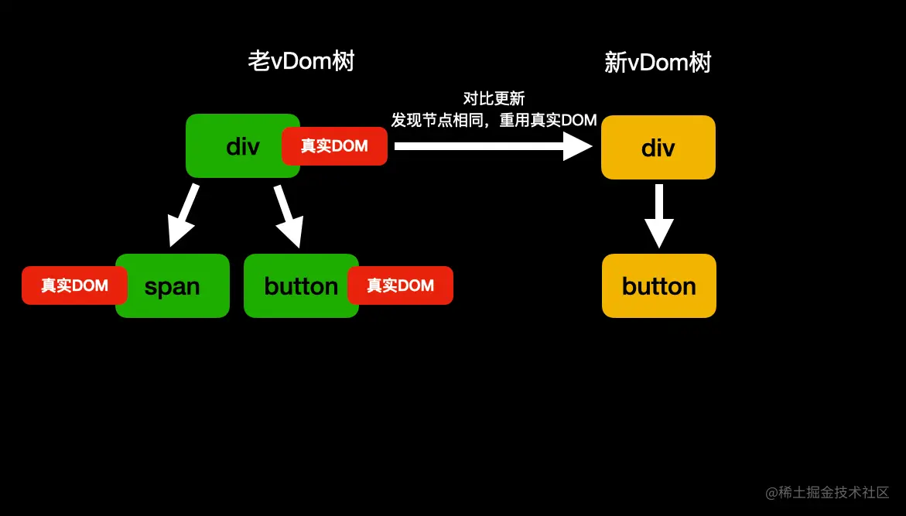

## [react渲染](https://juejin.cn/post/7121378029682556958)
### React element(初始元素)
> 通过React.createElement创建的类似真实DOM的元素，比如在开发中通过语法糖jsx写出来的html结构都是React element。

### React vDom(虚拟节点)
> React会根据初始元素或其它可以生成虚拟节点的东西生成虚拟节点。React是通过虚拟节点来进行渲染的。

#### 虚拟DOM节点(ReactDomComponent)
- 当初始元素的type属性为字符串的时候React就会创建虚拟DOM节点。
#### 虚拟组件节点(ReactComposite)
- 当初始元素的type属性为函数或是类的时候React就会创建虚拟组件节点。
#### 虚拟文本节点(ReactTextNode)
- 直接书写字符串或者数字React会创建为虚拟文本节点。
#### 虚拟空节点(ReactEmpty)
- 当遇到字面量null、false、true、undefined在React中均会被创建为一个虚拟空节点。在渲染过程中如果遇到虚拟空节点，那么它将什么都不会做。
#### 虚拟数组节点（ReactArrayNode）
- 当React遇到数组时会创建虚拟数组节点。但是不会直接进行渲染，而是将数组里的每一项拿出来，根据不同的节点类型去做相应的事情。
- 数组里的每一项只能是这里提到的五个虚拟节点类型。
### 真实DOM(UI)
> 通过document.createElement创建的元素就是真实DOM。

### 渲染原理
- React的工作是通过初始元素或可以生成虚拟节点的东西生成虚拟节点然后针对不同的节点类型去做不同的事情最终生成真实DOM挂载到页面上，对象不能直接被渲染是因为它生成不了虚拟节点。


### 首次渲染阶段
#### 虚拟DOM节点
- 对于初始元素的type属性为字符串时(虚拟DOM节点)，React会通过document.createElement创建真实DOM。
- 创建完真实DOM后会立即设置该真实DOM的所有属性，比如我们直接在jsx中书写的className、style等属性都会作用到真实DOM上。
- 在设置完属性后React会根据children属性进行递归遍历，根据不同的节点类型去做不同的事情。
#### 虚拟组件节点
- 函数组件
  1. 对于函数组件会直接调用函数，将函数的返回值进行递归处理，根据不同的节点类型去做不同的事情，最终生成一颗vDOM树。

- 类组件
  1. 首先创建类的实例(调用constructor)。
  2. 调用生命周期方法static getDerivedStateFromProps。
  3. 调用生命周期方法render，根据返回值进行递归处理。跟函数组件处理返回值一样，最终生成一颗vDom树。
  4. 将该组件的生命周期方法componentDidMount加入到执行队列中等待真实DOM挂载到页面后执行(注意：前面说了render是一个递归处理，所以如果一个组件存在父子关系的时候，那么肯定要等子组件渲染完父组件才能走出render，所以子组件的componentDidMount一定是比父组件先入队列的，肯定先运行)。
#### 虚拟文本节点
- 针对虚拟文本节点，React会通过document.createTextNode创建真实的文本节点。
#### 虚拟空节点
- 针对虚拟空节点，React什么都不会做。
#### 虚拟数组节点
- React不会直接渲染数组，而是将里面的每一项拿出来遍历，根据不同的节点类型去做不同的事，直到递归处理完数组里的每一项。
### 首次渲染例子
> 控制台执行顺序是111、222、444、555、666、333。

```
import React from 'react';
import ReactDOM from 'react-dom/client';
const root = ReactDOM.createRoot(document.getElementById('root'));

/**
 * 组件节点-类组件
 */
class ClassSon extends React.Component {
  constructor(props) {
    super(props);
    console.log("444 ClassSon constructor");
  }

  static getDerivedStateFromProps(props, state) {
    console.log("555 ClassSon getDerivedStateFromProps");
    return {};
  }

  componentDidMount() {
    console.log("666 ClassSon componentDidMount");
  }

  render() {
    return (
      <div className="func-wrapper">
        <span>
          textNode22
          {undefined}
        </span>
        {[false, "textNode33", <div>textNode44</div>]}
      </div>
    )
  }
}

/**
* 组件节点-类组件
*/
class ClassComp extends React.Component {

  constructor(props){
    super(props);
    console.log("111 ClassComp constructor");
  }

  static getDerivedStateFromProps(props, state){
    console.log("222 ClassComp getDerivedStateFromProps");
    return {};
  }

  componentDidMount(){
    console.log("333 ClassComp componentDidMount");
  }
  
  render() {
    return (
      <div className="class-wrapper">
        <ClassSon />
        <p>textNode11</p>
        {123456789}
      </div>
    )
  }
}

root.render(<ClassComp />);
```

### 组件更新阶段
> 使用setState来重新设置组件的状态进行重新渲染。使用setState只会更新调用此方法的类，不会涉及到兄弟节点以及父级节点，影响范围仅仅是自己的子节点。

1. 运行当前类组件的生命周期静态方法static getDerivedStateFromProps。根据返回值合并当前组件的状态。
2. 运行当前类组件的生命周期方法shouldComponentUpdate。如果该方法返回的false，直接终止更新流程。
3. 运行当前类组件的生命周期方法render得到一个新的vDom树，进入新旧两棵树的对比更新。
4. 将当前类组件的生命周期方法getSnapshotBeforeUpdate加入执行队列，等待将来执行。
5. 将当前类组件的生命周期方法componentDidUpdate加入执行队列，等待将来执行。
6. 重新生成vDom树。
7. 根据vDom树更新真实DOM.
8. 执行队列，此队列存放的是更新过程中所有新建类组件的生命周期方法componentDidMount。
9. 执行队列，此队列存放的是更新过程涉及到原本存在的类组件的生命周期方法getSnapshotBeforeUpdate。
10. 执行队列，此队列存放的是更新过程涉及到原本存在的类组件的生命周期方法componentDidUpdate。
11. 执行队列，此队列存放的是更新过程中所有卸载的类组件的生命周期方法componentWillUnMount。
### 根节点更新(ReactDOM.createRoot().render)
> 无论我们在嵌套多少的组件里去调用控制区域.render，都会直接触发根节点的对比更新。一般不会这么操作，如果触发了根节点的更新，那么后续步骤是上面组件更新的6-11步。

### Diff对比-节点类型一致
#### 虚拟DOM节点
- 如果是虚拟DOM节点，React会直接重用之前的真实DOM。将这次变化的属性记录下来，等待将来完成更新。然后遍历其子节点进行递归对比更新。
#### 虚拟组件节点
- 函数组件
> React会重新调用函数拿到新的vDom树，然后递归进行对比更新。

- 类组件
> React也会重用之前的实例对象，后续步骤如下。

  1. 运行生命周期静态方法static getDerivedStateFromProps。将返回值合并当前状态。
  2. 运行生命周期方法shouldComponentUpdate，如果该方法返回false，终止当前流程。
  3. 运行生命周期方法render，得到新的vDom树，进行新旧两棵树的递归对比更新。
  4. 将生命周期方法getSnapshotBeforeUpdate加入到队列等待执行。
  5. 将生命周期方法componentDidUpdate加入到队列等待执行。
#### 虚拟文本节点
- 如果是虚拟文本节点，React也会重用之前的真实文本节点。将新的文本记录下来，等待将来统一更新(设置nodeValue)。
#### 虚拟空节点
- 针对虚拟空节点，React什么都不会做。
#### 虚拟数组节点
- React不会直接渲染数组，而是将里面的每一项拿出来遍历，根据不同的节点类型去做不同的事，直到递归处理完数组里的每一项。
### Diff对比-节点类型不一致
> 如果找到了对比目标但是发现节点类型不一致，React会认为连类型都变了那么你的子节点肯定也都不一样了。就算一万个子节点，并且他们都是没有变化的，只要最外层的父节点的节点类型变了，照样会全部进行卸载重新创建，与其去一个个递归查看子节点，不如直接全部卸载重新新建。


### Diff对比-未找到对比目标
- 如果未找到对比的目标，跟节点类型不一致的做法类似，那么对于多出的节点进行挂载流程，对于旧节点进行卸载直接弃用，如果其包含子节点进行递归卸载，对于虚拟类组件节点会多一个步骤，那就是运行生命周期方法componentWillUnmount。
- 应尽量保持结构的稳定性，如果未添加key的情况下，兄弟节点更新位置前后错位一个那么后续全部的比较都会错位导致找不到对比目标从而进行卸载新建流程，对性能大打折扣。

> 从图中可以看到，经过条件渲染前后button理论上没有任何变化的情况下，照样没有重用之前的真实DOM，如果在button之后还有一万个兄弟节点，那么也全部都找不到对比目标从而进行卸载重新创建流程。所以在进行条件渲染显示隐藏时，官方推荐以下做法：

  - 控制style：visibility来控制显示隐藏。
  - 在隐藏时给一个空节点来保证对比前后能找到同一位置。不影响后续兄弟节点的比较。
