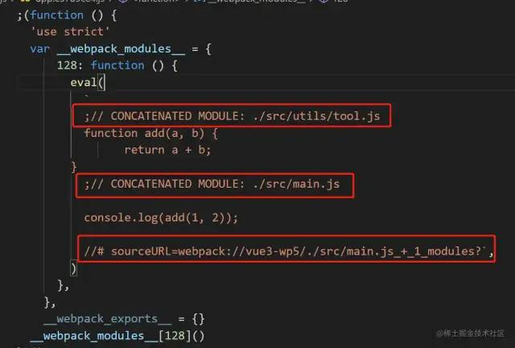
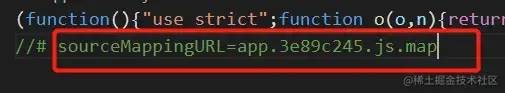
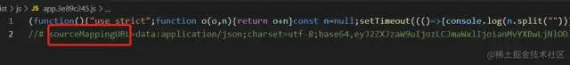
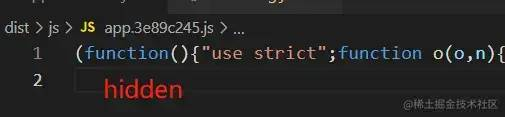
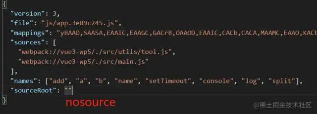
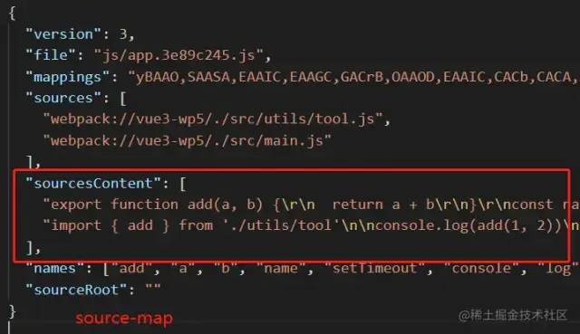

## sourcemap
> sourcemap是从已转换的代码映射到原始代码的文件。包含着源代码与构建产物之间的映射关系，作用是实现运行时代码和开发时代码都能拥有相同准确的信息提示。

### sourcemap文件不会影响网页性能
> sourcemap只有在打开devtools的情况下才会开始下载，而大部分用户不会去打开这个面板，所以这就不是问题了。浏览器隐藏了sourcemap文件的下载，使用抓包工具可以看到sourcemap文件的下载。

### 源文件和sourcemap文件关系
> webpack开启了sourcemap功能之后，build后的js文件都会有一个对应的.js.map文件，而在build后的js文件中有一段注释标记了该文件对应的sourcemap文件地址。

```
// main.d4c530be.js
...
...
...
//# sourceMappingURL=main.d4c530be.js.map
```
### sourcemap选项
> webpack中只要通过设置devtool的选项配置即可，值类型包括以下类型的组合。

- none（默认值）
  1. 不会生成map文件。
- eval
  1. 会生成被eval函数包裹的模块内容，并在其中通过注释来注明是源文件位置，其中的sourceUrl是用来来指定文件名。
  2. 优点是快因为不用生成.map文件，并且运行时代码映射到开发时代码只需要提供对应的源文件地址。
  3. 缺点就是包含映射信息少，并且eval函数因为安全性问题也是不建议使用的。

- source-map
  1. 会生成单独的.map文件包含version、file、sources、sourcesContent、names、mappings、sourceRoot等信息，需要进行mapping和编码工作。
  2. 优点就是拥有单独的.map文件，使得运行时代码体积不会过大，并且能够提供详细的信息，包含文件名、行、列等信息。
  3. 缺点就是慢，因为需要额外生成.map文件，并且随着模块内容的增多整体速度就越慢。

- cheap
  1. 和source-map的方式不同，cheap只会映射到源码的行信息，即它不会生成源码的列信息，也不包含loader的 sourcemap，因此相对来说会比source-map的方式更快。
  2. 优点就是速度更快，只映射到源码的行信息的原因是：通常在进行错误定位时，大多数情况下只需要关注到行就可以知道错误原因，而很少会关注到列，因此列信息其实不是必要性的。
  3. 缺点就是映射信息会不够精确，因为一个文件可能会经过不同loader的处理，而它又不生成loader相关的sourcemap，自然会导致最终产物的信息不够精确。
- module
  1. module的方式生成的sourcemap就会包含和loader相关的sourcemap信息。
  2. 需要loader相关的sourcemap信息的原因在于当一个文件被多个laoder依次进行转换处理后，其内容会发生不同的变化，就会使得我们无法去调试最初始的代码内容。
- inline
  1. 会将原本生成的.map文件的内容作为DataURL（base64 形式）嵌入bundle文件中，不单独生成.map文件。

- hidden
  1. 会生成单独的.map文件，但是相比于source-map的形式，其会在对应的bundle文件中隐藏sourceMappingURL的路径。

- nosources
  1. 在source-map生成的.map文件中的sourceContent存储的是源码内容，这样的好处是既可以根据文件路径来映射，也可以根据这部分内容来映射，source-map提供了双重保险，但也增加了.map文件体积。
  2. nosources则是在能够保证文件路径可以准确建立映射的情况下，就可以把sourceContent的内容给去除掉，使得.map文件体积能够更小一些。


### 生产环境建议使用
> 生产环境下为了防止别人获取源代码，通常不会将sourcemap文件上传到静态资源服务器，而是上传到内部服务器上。当用户触发js错误时，通过前端监控系统或者其他手段收集到出错信息，然后根据内部服务器的sourcemap结合出错信息，找到出错的源代码位置。

- source-map
  1. map文件包含完整的原始代码，但是打包会很慢。打包后的js最后一行是map文件地址的注释。
  2. 生产环境报错会正确提示错误的行数、列数，会显示源代码。source面板会显示源代码目录结构和代码。
- nosources-source-map
  1. 生成的map文件不包含源码。
  2. 生产环境报错会正确提示错误的行数。source面板会显示源代码目录结构和文件名，不会显示代码。
- hidden-source-map
  1. 与source-map相同，也会生成map文件，但是打包后的js最后没有map文件地址的引用。
  2. 生产环境报错不会提示错误的行数、列数，source面板不会显示源代码目录结构和代码。
### 通过sourcemap定位源码信息
- 解析源码使用source-map插件，直接使用error信息的source字段对应的文件可能无法解析到源码(webpack分包情况下)，可以使用error的stack堆栈信息的第一条对应的文件进行解析。
- 使用error-stack-parser插件解析error的stack堆栈信息。
```
const sourceMap = require("source-map");
const ErrorStackParser = require('error-stack-parser');
const fs = require("fs");

// 解析错误堆栈信息(errorStack为js错误信息的stack字段内容)
const errorStackData = ErrorStackParser.parse(new Error(errorStack));
const { fileName, lineNumber, columnNumber } = errorStackData?.[0] || {};
if (fileName.split('/').pop()) {
  // 读取对应的.js.map文件
  const mapObj = fs.readFileSync(`${__dirname}/../public/static/js/${fileName.split('/').pop()}.map`, 'utf-8');
  const consumer = await new sourceMap.SourceMapConsumer(mapObj);
  // 根据报错信息映射出报错的源文件和错误的行数、列数
  const originalInfo = consumer.originalPositionFor({ line: lineNumber, column: columnNumber });
  // 获取报错源文件的代码
  const sourceCode = consumer.sourceContentFor(originalInfo.source);
  // 错误源码信息
  const errorSource = {
    ...originalInfo,
    sourceCode,
  }
}
```
### 浏览器中sourcemap生效
> 浏览器默认会开启sourcemap，如果没有开启可以通过 settings => preferences => enable javascript source map 开启sourcemap。

### sentry上传sourcemap文件
- [sentry](https://juejin.cn/post/7209648356530962489#heading-10)
