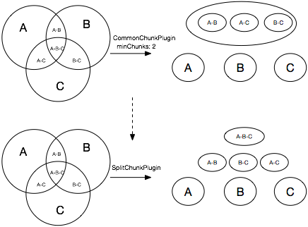
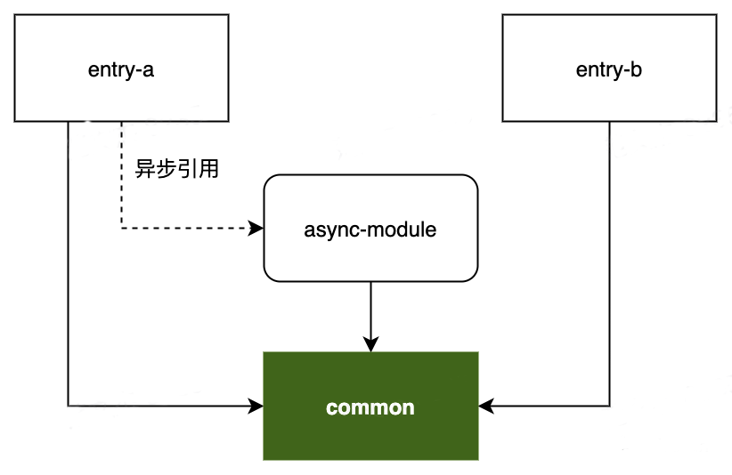
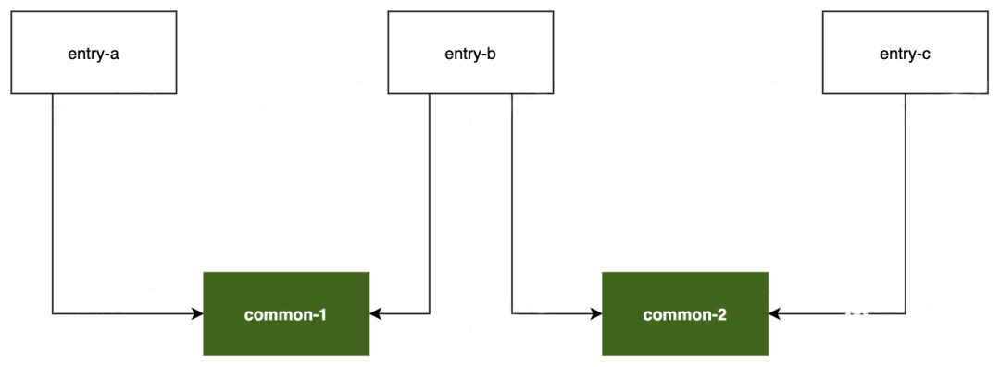

## [SplitChunksPlugin](https://segmentfault.com/a/1190000042093955)
> 默认情况下，Webpack会将所有代码构建成一个单独的包，这在小型项目通常不会有明显的性能问题，但伴随着项目的推进，包体积逐步增长可能会导致应用的响应耗时越来越长。一个多页面应用，所有页面都依赖于相同的基础库，那么这些所有页面对应的entry都会包含有基础库代码，所以需要对产物做适当的分解拆包。

### 所有资源打包成一个文件方式的弊端
- 资源冗余：客户端必须等待整个应用的代码包都加载完毕才能启动运行，但可能用户当下访问的内容只需要使用其中一部分代码。
- 缓存失效：将所有资源达成一个包后，所有改动——即使只是修改了一个字符，客户端都需要重新下载整个代码包，缓存命中率极低。

### CommmonsChunkPlugin
> CommmonsChunkPlugin的思路是将满足minChunks所设置的条件的模块移到一个新的chunk文件中去，这个思路是基于父子关系的，也就是这个新产出的new chunk是所有chunk的父亲，在加载孩子chunk的时候，父亲chunk是必须要提前加载的。

- 同步模块加载
```
// example：
entryA: vue vuex  someComponents 
entryB: vue axios someComponents 
entryC: vue vuex axios someComponents 

minchunks: 2

// 产出后的chunk，对entryA和entryB来说，vendor-chunk都包含了多余的module。
vendor-chunk：vue vuex axios 
chunkA~chunkC: only the components
```
- 异步的模块
```
// example：
entryA: vue vuex  someComponents 
asyncB: vue axios someComponents 
entryC: vue vuex axios someComponents 

minchunks: 2

// 产出后的chunk，如果asyncB在entryA中动态引入，则会引入多余的module。
vendor-chunk：vue vuex  
chunkA: only the components
chunkB: vue axios someComponents 
chunkC: axios someComponents
```
#### CommonsChunkPlugin的问题：
- 可能会导致许多不必要的代码代码被加载。
- 会影响异步加载的chunk。
- 高优的chunk产出需要的minchunks配置比较复杂。
### SplitChunksPlugin
> 会使用模块重复计数和模块种类自动识别哪些chunk需要被分离。基于一些启发式的规则将Module编排进不同的Chunk序列，并最终将应用代码分门别类打包出多份产物，从而实现分包功能。

- 不会下载不必要的模块（只要你强制使用name属性合并chunk）
- 对异步加载的chunk也有效
- 处理从多个vendor chunks分离出来的vendor
- 更容易使用
- 更加自动化
### CommmonsChunkPlugin VS SplitChunksPlugin
> CommonsChunkPlugin就类似于：创建这个chunk并且把所有与minChunks字段匹配的模块移到新的chunk中。而SplitChunksPlugin就类似于：这是启发式的，确保你需要他们。（命令式vs声明式）



### SplitChunksPlugin使用
- SplitChunksPlugin通过module被引用频率、chunk大小、包请求数三个维度决定是否执行分包操作，这些决策都可以通过 optimization.splitChunks配置项调整定制，基于这些维度我们可以实现：单独打包某些特定路径的内容，例如node_modules打包为 vendors；单独打包使用频率较高的文件。
- SplitChunksPlugin还提供配置组概念optimization.splitChunks.cacheGroup，用于为不同类型的资源设置更有针对性的配置信息。
- SplitChunksPlugin还内置了default与defaultVendors两个配置组，提供一些开箱即用的特性：
  - node_modules资源会命中defaultVendors规则，并被单独打包。
  - 只有包体超过20kb的Chunk才会被单独打包。
  - 加载 Async Chunk 所需请求数不得超过30。
  - 加载 Initial Chunk 所需请求数不得超过30。
#### 分包范围（chunks）
> SplitChunksPlugin默认只对Async Chunk生效，开发者也可以通过optimization.splitChunks.chunks调整作用范围，该配置项支持如下值：

- 字符串'all' ：对Initial Chunk与Async Chunk都生效，建议优先使用该值。
- 字符串'initial'：只对Initial Chunk生效。
- 字符串'async'：只对Async Chunk生效。
- 函数 (chunk)=>boolean：该函数返回true时生效。
```
module.exports = {
  //...
  optimization: {
    splitChunks: {
      chunks: 'all',
    },
  },
}
```
#### 根据Module使用频率分包(minChunks)
> SplitChunksPlugin支持按Module被Chunk引用的次数决定是否进行分包，开发者可通过optimization.splitChunks.minChunks设定最小引用次数。

```
module.exports = {
  //...
  optimization: {
    splitChunks: {
      // 设定引用次数超过 3 的模块才进行分包
      minChunks: 3
    },
  },
}
```

> entry-a、entry-b分别被视作Initial Chunk处理；async-module被entry-a以异步方式引入，因此被视作Async Chunk处理。那么对于common模块来说，分别被三个不同的Chunk引入，此时引用次数为 3，命中optimization.splitChunks.minChunks=2规则，因此该模块「可能」会被单独分包，最终产物：entry-a.js entry-b.js async-module.js common.js。

#### 限制分包数量(maxInitialRequest/maxAsyncRequests)
> 在满足minChunks基础上，还可以通过maxInitialRequest/maxAsyncRequests配置项限定分包数量。这里所说的“请求数”，是指加载一个Chunk时所需同步加载的分包数。例如对于一个Chunk A，如果根据分包规则(如模块引用次数、第三方包)分离出了若干子Chunk A¡，那么请求A时，浏览器需要同时请求所有的A¡，此时并行请求数等于¡个分包加A主包，即¡+1。

- maxInitialRequest：用于设置Initial Chunk最大并行请求数。
- maxAsyncRequests：用于设置 Async Chunk 最大并行请求数。

> 若minChunks=2，则common-1 、common-2同时命中minChunks规则被分别打包，浏览器请求entry-b时需要同时请求common-1、common-2两个分包，并行数为2+1=3，此时若maxInitialRequest= 2，则分包数超过阈值，SplitChunksPlugin会放弃common-1、common-2中体积较小的分包。maxAsyncRequest逻辑与此类似。

#### 限制分包体积(minSize、maxSize.........)
- minSize：超过这个尺寸的Chunk才会正式被分包。
- maxSize：超过这个尺寸的Chunk会尝试继续做分包。
- maxAsyncSize：与maxSize功能类似，但只对异步引入的模块生效。 
- maxInitialSize：与maxSize类似，但只对entry配置的入口模块生效。
- enforceSizeThreshold：超过这个尺寸的Chunk会被强制分包，忽略上述其它size限制。
#### SplitChunksPlugin的主体流程
- SplitChunksPlugin尝试将命中minChunks规则的Module统一抽到一个额外的Chunk对象。
- 判断该Chunk是否满足maxInitialRequests阈值，若满足则进行下一步。
- 判断该 Chunk 资源的体积是否大于上述配置项minSize声明的下限阈值。
  - 如果体积「小于」 minSize则取消这次分包，对应的Module依然会被合并入原来的Chunk。
  - 如果Chunk体积「大于」minSize则判断是否超过maxSize、maxAsyncSize、maxInitialSize声明的上限阈值，如果超过则尝试将该Chunk继续分割成更小的部分。
```
这些属性的优先级顺序为：

maxInitialRequest/maxAsyncRequests < maxSize < minSize

而命中 enforceSizeThreshold 阈值的 Chunk 会直接跳过这些属性判断，强制进行分包。
```
#### cacheGroups
> cacheGroups配置项用于为不同文件组设置不同的规则，通过cacheGroups属性设置vendors缓存组，所有命中vendors.test规则的模块都会被视作vendors分组，优先应用该组下的minChunks、minSize等分包配置。缓存组的作用在于能为不同类型的资源设置更具适用性的分包规则，一个典型场景是将所有node_modules下的模块统一打包到vendors产物，从而实现第三方库与业务代码的分离。

- test：接受正则表达式、函数及字符串，所有符合test判断的Module或Chunk都会被分到该组。
- type：接受正则表达式、函数及字符串，与test类似均用于筛选分组命中的模块，区别是它判断的依据是文件类型而不是文件名，例如type='json'会命中所有JSON文件。
- name：chunk命名。
- priority：数字型，用于设置该分组的优先级，若模块命中多个缓存组，则优先被分到priority更大的组。
**默认分组**
> 这两个配置组可以 将所有node_modules中的资源单独打包到vendors.js命名的产物。对引用次数大于等于2的模块，也就是被多个Chunk引用的模块，单独打包。

```
module.exports = {
  //...
  optimization: {
    splitChunks: {
      chunks: 'async',
      minSize: 30000,
      maxSize: 0,
      minChunks: 1,
      maxAsyncRequests: 5,
      maxInitialRequests: 3,
      automaticNameDelimiter: '~',
      name: true,
      cacheGroups: {
        vendors: {
          test: /[\\/]node_modules[\\/]/,
          priority: -10
        },
        default: {
          minChunks: 2,
          priority: -20,
          reuseExistingChunk: true
        }
      }
    }
  }
};
```
#### SplitChunksPlugin最佳实战
- 尽量将第三方库拆为独立分包
- 保持按路由分包，减少首屏资源负载
- 尽量保持 chunks='all'

### 生产环境的output不能使用hash，应该使用contenthash或者chunkhash，开发环境只能使用hash。