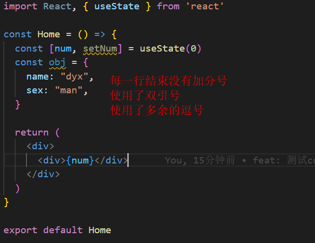
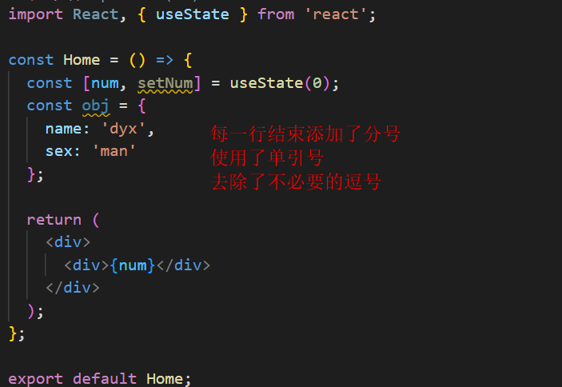
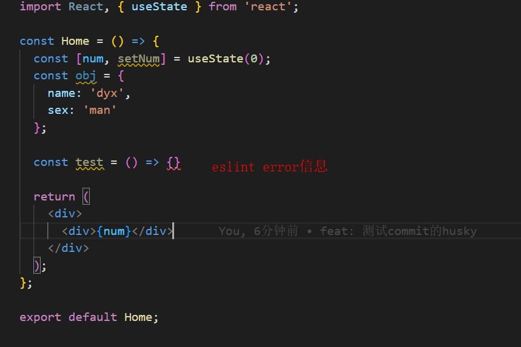
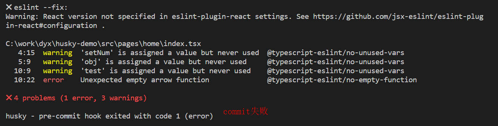

## ESlint + Prettier + husky + lint-staged规范前端项目
### ESlint代码检查工具
> JavaScript代码的检查工具，ESlint能够查找并修复JavaScript代码中的问题。

#### 安装依赖 npm i eslint -D
#### 常用命令
- npx eslint src          检查src目录下的代码问题
- npx eslint src --quiet  只检查src目录下的代码的error问题
- npx eslint --fix src    自动修复src目录下可潜在修复的错误
#### ESlint配置文件
- 执行命令初始化ESlint配置(根据提示进行选择) npm init @eslint/config。
  1. 选择 To check syntax and find problems (检查语法和查找错误)
  2. 选择ES Module的模块规范
  3. 选择react框架
  4. 选择使用TypeScript
  5. 选择browser运行环境
  6. 选择使用js文件作为配置文件
  7. 根据选择安装推荐的相关依赖 eslint-plugin-react、 @typescript-eslint/eslint-plugin、 @typescript-eslint/parser
  8. 生成.eslintrc.js配置文件
- .eslintrc.js配置文件中的extends和rules字段定义了在项目中采用哪些规则。
- .eslintrc.js使用ignorePatterns在一些目录下禁用eslint规则。
```
// ESlint规则禁用config文件夹
ignorePatterns: ["config/"]
```
#### 配合编辑器使用ESlint
- 在VSCode中使用ESlint需要安装ESlint插件。启用插件后可以在编辑代码的同时看到哪些代码有问题，及时发现及时修复。
- 启用编辑器的保存自动修复功能，不用执行额外的ESlint命令。
> 左下角管理图标 => 设置 => 文本编辑器 => 在settings.json中编辑。

```
// VSCode settings.json
{
  // ...
  "editor.codeActionsOnSave": {
    "source.fixAll.eslint": true
  }
}
```
### Prettier代码格式化工具

#### 安装依赖 npm i prettier eslint-config-prettier eslint-plugin-prettier -D
#### 常用命令
- npx prettier --write src  格式化src目录下的代码文件
#### 解决ESlint和Prettier的冲突。
> 同时使用二者需要关闭ESlint中可能和Prettier冲突的规则。.eslintrc.js文件中的extend中添加"prettier"解决ESlint和Prettier的冲突。

```
// .eslintrc.js
module.exports = {
  // ...
  "extends": [
    // ...
    "prettier"
  ],
}
```
#### 创建.prettierrc文件，并配置自己的规则。
```
{
  "endOfLine": "auto",
  "printWidth": 80, 
  "semi": true,
  "trailingComma": "none",
  "singleQuote": true,
  "arrowParens": "avoid"
}
```
### Prettier vs ESLint
> 都会对代码AST（语法树）进行检查，但Prettier只会进行语法分析，只能检查并归正代码的格式问题，而ESLint还会进一步对代码进行语义分析，能发现格式问题和代码模式问题。ESLint只能检查JavaScript代码以及TypeScript、JSX等衍生代码（需配置解析器），无法检查项目中的CSS、HTML等代码。Prettier则天然支持对大多数项目文件的格式化。

### husky + lint-staged代码提交前检查、格式化代码
#### husky
> 操作git钩子的工具。

- 安装依赖 npm i husky -D
- 在packgae.json中添加prepare脚本。
> prepare脚本会在npm install之后自动执行。当执行npm install安装完项目依赖后会执行husky install命令，该命令会创建.husky/目录并指定该目录为git hooks所在的目录。

```
// package.json
{
  // ...
  "scripts": {
    // ...
    "prepare": "husky install"
  }
}
```
- 执行命令npm run prepare
#### lint-staged
> 本地暂存代码检查工具，每一次提交只检查本次提交所修改(指git暂存区里的东西)的内容，而不是每次检查是整个项目的内容。

- 安装依赖 npm install lint-staged -D
- package.json添加lint-staged的命令
> src/**/*.{js,jsx,ts,tsx} 只对src目录下的js,jsx,ts,tsx文件进行格式化，对应的三条命令会先后分别执行，eslint --fix之后使用Prettier格式化代码，然后git add，最后执行我们的git commit。

```
"lint-staged": {
  "src/**/*.{js,jsx,ts,tsx}": [
    "eslint --fix",
    "prettier --write",
    "git add"
  ]
},
```
- 设置git的pre-commit钩子执行npx lint-staged命令
```
npx husky add .husky/pre-commit "npx lint-staged"
```
### 测试commit效果
- 提交时Prettier会格式化代码。


- 存在eslint的error信息时commit失败。
> eslint存在error信息时才会阻止提交(warning信息不会阻止提交)，如果阻止了commit提交或者代码格式化后没有任何修改，eslint --fix以及Prettier格式化不会生效。




