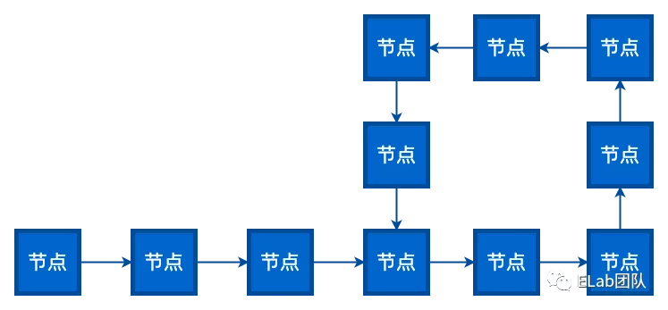

## 链表
- 由若干个结点链结成一个链表，称之为链式存储结构。
- 通过next指针来链接, 最底层为null。
```
const Node = function(data) {
  this.data = data;
  this.next = null;
}

const node1 = new Node(1);
const node2 = new Node(2);
const node3 = new Node(3);

node1.next = node2;
node2.next = node3;
```
### 链表和数组的区别
- 链表和数组都可以存储多个数据。数组需要一块连续的内存空间来存储数据，对内存的要求比较高。而链表却相反，它并不需要一块连续的内存空间。
- 链表是通过指针将一组零散的内存块串联在一起。相比数组链表是一种稍微复杂一点的数据结构。两者没有好坏之分各有各的优缺点。
- 由于内存存储特性，数组可以实现快速的查找元素，但是在插入和删除时就需要移动大量的元素。原因就在于相邻元素在内存中的位置也是紧挨着的，中间没有空隙，因此就无法快速添加元素。而当删除后，内存空间中就会留出空隙，自然需要弥补。
### 链表分类
- 单向链表


- 双向链表


- 单向循环链表


- 双向循环链表


- 环形链表


- 相交链表


- 回文链表


